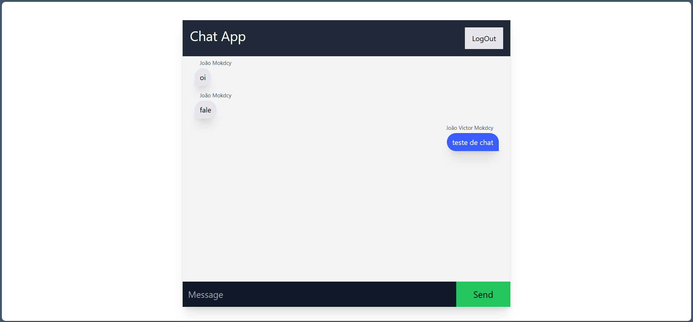

# CineMonkeys



## 📄 Goal:
Create an app that signs in with Google. As well as send and receive messages from users 

## ☕ Using CineMonkeys

to use CineMonkeys, follow these steps:

1. open the git bash terminal
2. enter the following code:
```
git clone https://github.com/MokdcyVictor/skytape.git
```

## 🔧 Function
- [X] Send and receive messages from other users
- [X] user login with Google
## 🙋‍♂️ Authors:
<table>
  <tr>
    <td align="center">
      <a href="#">
        <br>
        <sub>
          <b>João Mokdcy</b>
        </sub>
      </a>
    </td>
